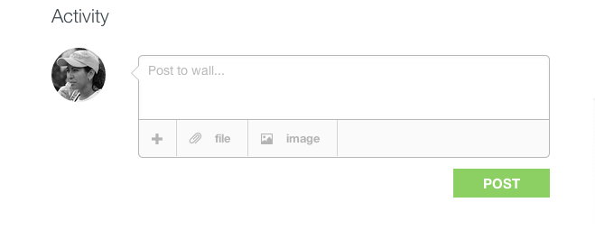
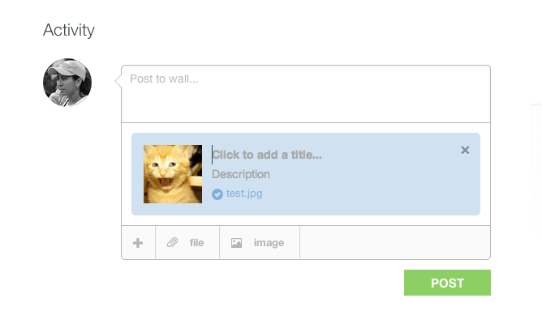
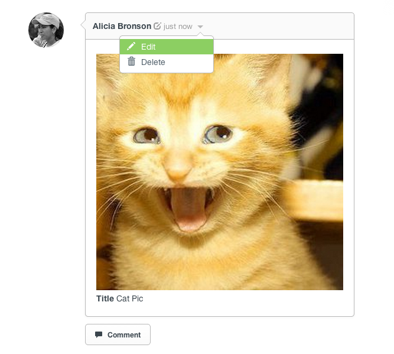
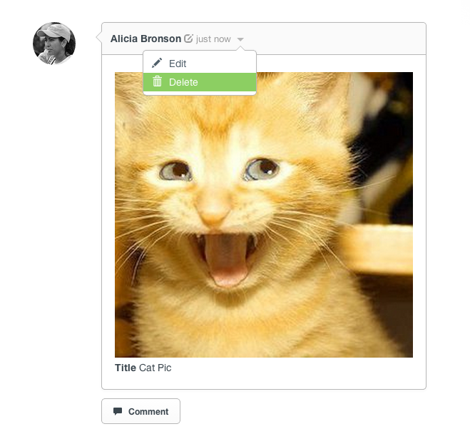

## Attachments

* [Adding an Attachment](attachments.html#adding-attachments)
* [Editing an Attachment](attachments.html#editing-attachments)
* [Deleting an Attachment](attachments.html#deleting-attachments)

[back to top](#top)

***

### Adding an Attachment

You can add an attachment to any Post, Question or Answer by simply clicking on the "+" sign at the bottom of the comment box.  This will create a pop up window to allow you to select any file from your computer.  

Once the file has been chosen a preview window allows you to add a title and description to the attachment.  

[back to guide](community-guide.html) | [back to top](#top)
***

### Editing an Attachment

You can edit any attachment by hovering over the attachment and then clicking the down arrow and then selecting 'Edit'.

This will bring you back to the preview window where you can edit the title and/or description.  

[back to guide](community-guide.html) | [back to top](#top)
***

### Deleting an Attachment

You can delete any attachment by again hovering over the attachment and clicking the down arrow, then selecting 'Delete'.

A confirmation window will appear and ask if you are sure you want to delete the attachment.  

Additionally you can delete any attachment by clicking on the 'X' in the upper right hand corner of the attachment in the preview screen.  

[back to guide](community-guide.html) | [back to top](#top)
***