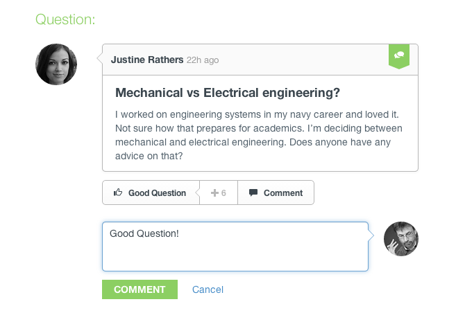
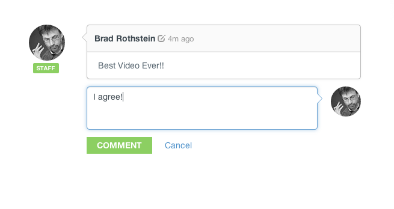
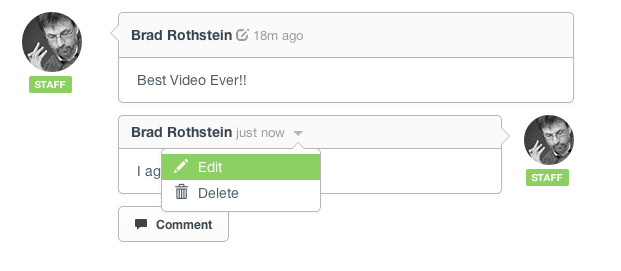
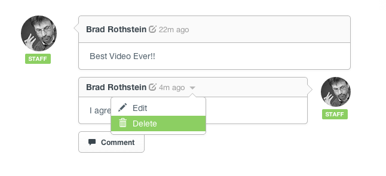
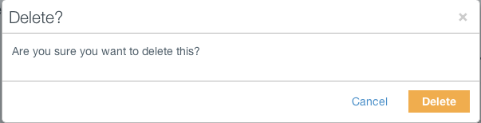

## Comments

* [Adding a Comment](comments.html#adding-comment)
* [Editing a Comment](comments.html#editing-comment)
* [Deleting a Comment](comments.html#deleting-comment)

[back to top](#top)

***

### Adding a Comment

Under any question or answer you can post a comment.  Simply click the 'Comment' button and a new field will appear to place the comment. 

***

In addition you can add a comment to any post, whether it's post about a video or just a post on a wall.  

Once the 'Comment' button is clicked, a notification and email (if opted) is sent to the poster regarding your comment

[back to guide](community-guide.html) | [back to top](#top)

***

### Editing a Comment

Editing a comment can be done by simply hovering over the comment and clicking the down arrow, then selecting 'Edit'.

[back to guide](community-guide.html) | [back to top](#top)

***

### Deleting a Comment

Deleting a comment can be done by again hovering over the comment and clicking the down arrow, then selecting 'Delete'.

A pop up confirmation window will appear and asking if you want to delete the comment.

[back to guide](community-guide.html) | [back to top](#top)

***