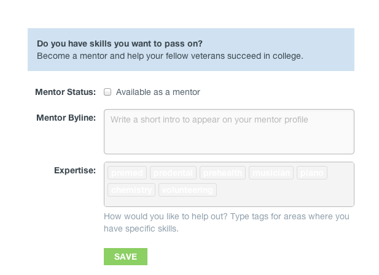
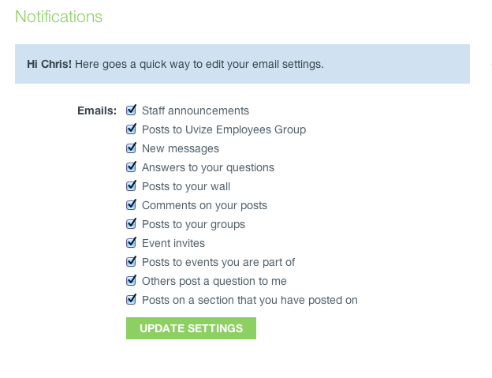
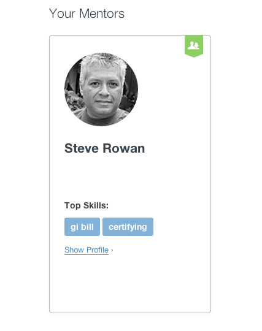
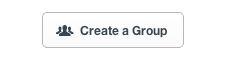
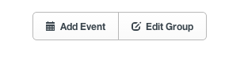
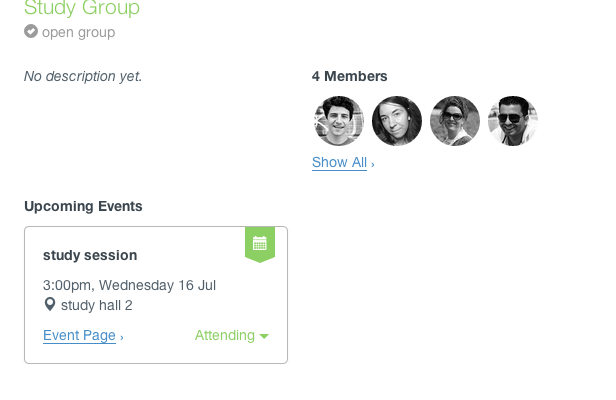
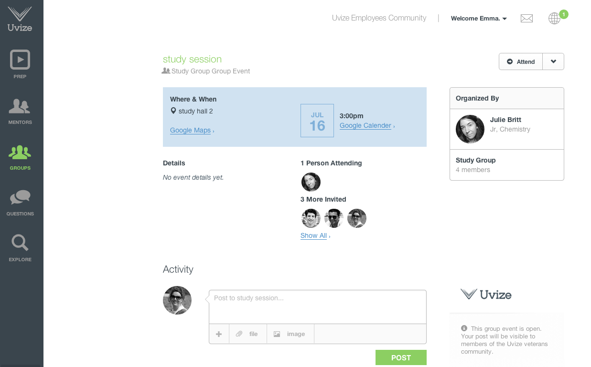
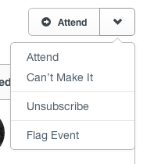
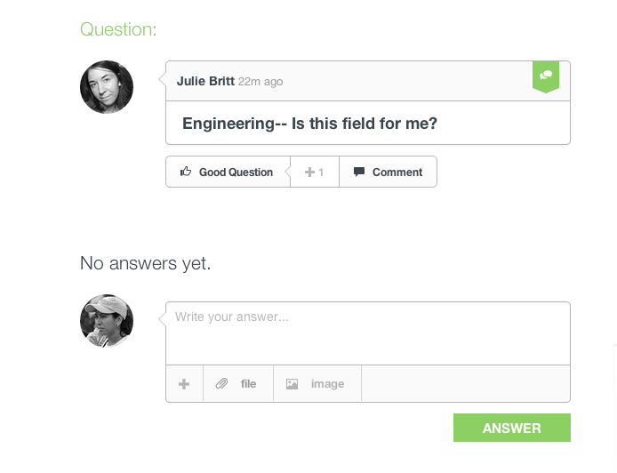

# <a name="top"></top>Community Guide

* [My Account](#account)
* [Mentors](#mentors)
* [Groups](#groups)
* [Events](#events)
* [Questions](#questions)

***

## My Account

* [Creating an account](#create-account)
* [Logging in](#logging-in)
* [Staying logged in](#remember-me)
* [Resetting your password](#reset-password)
* [Editing your profile](#edit-profile)
* [Uploading a profile image](#profile-image)
* [Uploading a cover image](#cover-image)
* [Editing your email preferences](#email-preferences)

[back to top](#top)

***

### Creating an account

You can create an account at [https://www.uvize.com/users/sign_up](https://www.uvize.com/users/sign_up).

Uvize is currently only allowing students to register from schools with a valid activation code.

If your school has a valid activation code, the registration page will look like this:

If you would like to learn how to get Uvize for your school, [click here](http://getuvize.com/).

[back to My Account](#account) | [back to top](#top)

***

### Logging in

You can log in at [Uvize.com](https://www.uvize.com/).

Or at [Uvize.com/users/sign_in](https://www.uvize.com/users/sign_in).

[back to My Account](#account) | [back to top](#top)

***

### Staying logged in

On [Uvize.com](https://www.uvize.com/), you can click the "remember me" checkbox to stay logged into Uvize. This will allow you to close the browser and stay logged in when you reopen the browser to another session.

[back to My Account](#account) | [back to top](#top)

***

### Resetting your password

You can reset your password at the following link: [reset password link](https://www.uvize.com/users/password/new).

After submitting your email address, click the "CHANGE PASSWORD" link within the "Reset password instructions" email.

If you did not submit the password reset request, you can ignore this email and your password will remain unchanged.

[back to My Account](#account) | [back to top](#top)

***

### Editing your profile

At any time, you can edit your profile by clicking your name > profile

Then click the 'edit profile' on your profile page.

From here, you can change your personal details, information, mentor details, email settings, and account settings.

#### Personal Details

Here you can change your profile picture, input your first and last name, and write a bio.

Your bio should be used information about yourself that you'd like to share with others. Your bio is searchable by others, so remember that it'll help others to find you.

See [Uploading a profile image](#profile-image) to learn more about profile images.

#### Information

This is where you can change your major, your year, or your branch of service.

Majors are searchable, so be sure to include yours so other students can see what you're studying.

At this time, your year can be Freshman, Sophomore, Junior, Senior, or Grad Student.

Of course, as a vet-founded company, we love all our military brethren, so be sure to input your branch of service as well if you have served.

#### Mentor Details

On the mentor details tab, you can choose whether or not you want to make yourself available as a mentor.

See [Becoming a mentor](#become-mentor) to learn more about mentorship.

#### Email Settings

Here you can edit your email settings.

See [email preferences](#email-preferences) to learn more about email settings.

#### Account Settings

On the account settings tab, you can choose to hire your profile from global users, change your email address, and change your password.

[back to My Account](#account) | [back to top](#top)

***

### Uploading a profile image

First, go to your profile by clicking your name > profile

Then click the 'edit profile' on your profile page.

From here, click "choose file" which will allow you to select a file from your computer/mobile device to upload as your profile picture.

Finally, click "save". Depending on the size of your file and Internet connection speed, it may take a few seconds to upload your image.

We currently have a 4MB limit for profile image upload sizes.

[back to My Account](#account) | [back to top](#top)

***

### Uploading a cover image

First, go to your profile by clicking your name > profile

From your profile page, hover over the area above your profile image and click "Choose a cover image" on the right-hand side.

This will allow you to select a file from your computer/mobile device to upload as your cover picture.

Finally click "save". Depending on the size of your file and Internet connection speed, it may take a few seconds to upload your image.

We currently have a 4MB limit for cover image upload sizes.

[back to My Account](#account) | [back to top](#top)

***

### Editing your email preferences

There are currently five settings for email notifications which you can enable or disable.

* When someone sends a message.
* When someone posts an answer to a question I posted.
* When someone posts on my wall.
* When someone posts on the wall of a group I am in.
* When someone comments on one of my posts.

Additionally, you can turn off emails (and notifications) from individual groups.

At any time, you can edit your profile by clicking your name > profile

Then click the 'edit profile' on your profile page.

Next, click the 'email settings' tab.

You can also unsubscribe from emails via the 'email settings' link within an email

From here, you'll see the same five settings for your account which you can enable or disable.

To turn off emails (and notifications) from individual groups, go to the group's page and click the "Notifications on" button so that it says "Notifications off"

[back to My Account](#account) | [back to top](#top)

***

## Mentors

* [Becoming a mentor](#become-mentor)
* [Searching mentors](#searching-mentors)
* [Bookmarking mentors](#bookmarking-mentors)
* [Engaging with a mentor](#engaging-mentors)

Mentorship is what makes a Uvize community work. Becoming a mentor is easy! Offering to answer questions within Uvize, and helping other students is how we'll all succeed.

[back to top](#top)

***

### Becoming a mentor

At any time, you can edit your profile by clicking your name > profile

Then click the 'edit profile' on your profile page.

On the mentor details tab, you can choose whether or not you want to make yourself available as a mentor.

If you do, then you can choose to offer your availability globally or just at your school.

You can also input a mentor byline. This is searchable and will help students find you, so be sure to write about how you're willing to help.

Finally, you can input expertise tags. These tags help students find you as well.

[back to Mentors](#mentors) | [back to top](#top)

***

### Searching mentors

From the [mentors page](https://www.uvize.com/community/mentors), you can search mentors.

Just input different search criteria and we'll search mentors by tags, mentor bylines, bio, and major.

[back to Mentors](#mentors) | [back to top](#top)

***

### Bookmarking mentors

Bookmarking a mentor allows you to 'save' a mentor that has been helpful to you or that you'd like to keep in contact with.

From a mentor's profile page, just click "Save to 'My Mentors'"

Now that mentor will show up on the mentors page.

[back to Mentors](#mentors) | [back to top](#top)

***

### Engaging with a mentor

Mentorship is fundamental in the success of students. When engaging with a mentor, always be respectful of the mentor's time. Mentors volunteer themselves to help others out of their own time. Do not be rude or harass a mentor. If a mentor is unable to help you, then politely thank them for their time and reach out to another mentor who may be able to help you.

[back to Mentors](#mentors) | [back to top](#top)

***

## Groups

* [Creating a group](#creating-group)
* [Administering a group](#admin-group)
* [Group privacy](#group-privacy)
* [Joining a group](#joining-group)
* [Leaving a group](#leaving-group)
* [Searching groups](#searching-groups)

Groups are a place to where students, mentors, and staff can meet and discuss common interests. Groups are commonly used for things such as common backgrounds (Army, MOS, etc), study groups (Bio 101 study group), majors (Mechanical Engineering majors), interests (Anime, TV shows), and more (Carpooling, etc).

[back to top](#top)

***

### Creating a group

Creating a group is easy. From the [groups page](https://www.uvize.com/community/groups), click the "Get Started" button.

From here, you must supply a group name. Optionally, you can add a description and tags for the group. The description and tags help others find your group when searching for groups.

Finally, you must choose the privacy level of your group. See [Group Privacy](#group-privacy) to learn more about privacy.

[back to Groups](#groups) | [back to top](#top)

***

### Administering a group

As a group administrator, you can edit your group settings at any time.

From the group's page, click the "group settings" link.

This will bring up the group settings form used to create the group, which you can now edit.

From here, you can view members, admins, pending requests, blocked, and add classmates.

On the members/admins tabs, you can see current members or admins and you have the ability to remove them, add them as an admin, or block them. To remove as a member, just uncheck them. To add them as an admin or block them, hover over their profile, then click options, and the corresponding checkbox.

For closed groups, when a user requests to join, they will show up on the pending requests tab.

For users that have been blocked, they will show up on the blocked tab.

Finally, the add classmates tab will show all of your school classmates, where you can add others to your group.

[back to Groups](#groups) | [back to top](#top)

***

### Group Privacy

There are two levels of privacy for groups within Uvize: Open or Closed.

* Open - The group message board and members are public, and anyone from your school can join the group.
* Closed - The group message board and members can only be seen by members. The group will still show up in search and new members can request an invite to join the group.

When you're on a closed group that you're not a member of, you can request to join by clicking the "request to join" button.

Additionally, groups from your school are _never_ viewable by a user at another school.

[back to Groups](#groups) | [back to top](#top)

***

### Joining a group

You can join an open group at any time. Simply click the "Join" button on the group's page.

When you're on a closed group that you're not a member of, you can request to join by clicking the "request to join" button.

[back to Groups](#groups) | [back to top](#top)

***

### Leaving a group

When you leave a group, you have the ability to not allow others to add you back to the group. This prevents others from continually adding you to a group over and over again.

If you're an admin for a group and you leave, you'll be warned if you're the last admin and that you should make someone else an admin before you leave, otherwise anyway can claim the admin position.

[back to Groups](#groups) | [back to top](#top)

***

### Searching groups

From the [groups page](https://www.uvize.com/community/groups), you can search groups.

Just input different search criteria and we'll search groups by group name, tags, and description.

[back to Groups](#groups) | [back to top](#top)

***

## Events

* [Creating an event](#creating-event)
* [Finding events](#finding-events)
* [Viewing an event](#viewing-event)
* [Managing an event](#managing-event)

Events allow the members of groups to plan places and times to meet in person. Group administrators can create events for anything. Maybe it's a study session for a study group, or a casual social gathering for Army veterans on campus, or a planning meeting for the carpool schedule. All you need is a place and a time!

[back to top](#top)

***

### Creating an event

Events are created from a group's page by an administrator of that group.

From a group's page, click the

link in the sidebar to bring up the event creation form:

You must enter a title, location, and start time. After you enter a location, you can click 

to make sure your location works with Google maps. If your event has an end time, click

 to set it.

When you're satisfied with your settings, click

to invite group members to the event:

All group members will be invited by default. Click

to remove all invitations, and

to add them back again. When you're happy with your list of invitations, click

to send them.

[back to Events](#events) | [back to top](#top)

***

### Finding events

You can find all the upcoming events for a group at the top of the group's page:

If you were invited to an event, you can quickly RSVP by clicking

and choosing an option from the pop-up:

[back to Events](#events) | [back to top](#top)

***

### Viewing an event

Click

to view an event's page:

Click

if you plan to attend the event, or use the dropdown if you can't make it:

If the event organizer has enabled it, click

to get a map to the event location. Click

to add the event to your calendar.

Click

or

to bring up the event attendance interface:

[back to Events](#events) | [back to top](#top)

***

### Managing an event

The organizer of an event can change its settings and its invites. From the page for an event you organized, open the dropdown:

Click "Edit Event" to bring up the event's settings:

See the guide for [creating an event](#creating-event) for more information on changing event settings.

Click "Edit Invites" to invite or uninvite group members:

See the guide for [creating an event](#creating-event) for more information on event invitations.

[back to Events](#events) | [back to top](#top)

***

## Questions

* [Asking a question](#asking-question)
* [Editing a question](#editing-question)
* [Deleting a question](#deleting-question)
* [Upvoting/Downvoting](#voting)
* [Searching questions](#searching-questions)
* [Answering a question](#answering-question)

[back to top](#top)

***

### Asking a question

From the [questions page](https://www.uvize.com/community/questions), click the "Ask a Question" button.

From here, you must supply a question. Optionally, you can add tags and details about the question. The tags and details help find your question when searching questions.

[back to Questions](#questions) | [back to top](#top)

***

### Editing a question

If you asked a question, you can edit it to further refine details or updates about the question.

From the question's page, hover over your question and click "edit".

[back to Questions](#questions) | [back to top](#top)

***

### Deleting a question

If you asked a question, you can delete it if you want to remove it.

WARNING: if you remove a question, it will no longer be searchable. If others' have answered you question, you should leave it up so that others can benefit from finding your question and answers if they have the same question.

From the question's page, hover over your question and click on the trash icon.

This will bring up a confirmation before deletion. Click "Delete" if you'd like to delete the question.

[back to Questions](#questions) | [back to top](#top)

***

### Upvoting/Downvoting

Voting helps the most useful content, whether it's a question or an answer, be found easier by other users.

From the [questions page](https://www.uvize.com/community/questions), you can upvote and downvote questions. Just click the up or down arrow to the right of the question.

From a question's page, you can upvote and downvote the question as well as the answers to the question. Just click the up or down arrow to the right of the question, or click the word 'upvote' to upvote.

You should only downvote questions and answers that are not constructive, helpful, or just plain wrong.

[back to Questions](#questions) | [back to top](#top)

***

### Searching questions

From the [questions page](https://www.uvize.com/community/questions), you can search questions.

Just input different search criteria and we'll search groups by group name, tags, and description.

You can further sort the questions by new questions.

[back to Questions](#questions) | [back to top](#top)

***

### Answering a question

From a question's page, you can answer it by filling out the form below the question.

Answering questions is how we, as a community, can give back to one another.

[back to Questions](#questions) | [back to top](#top)
