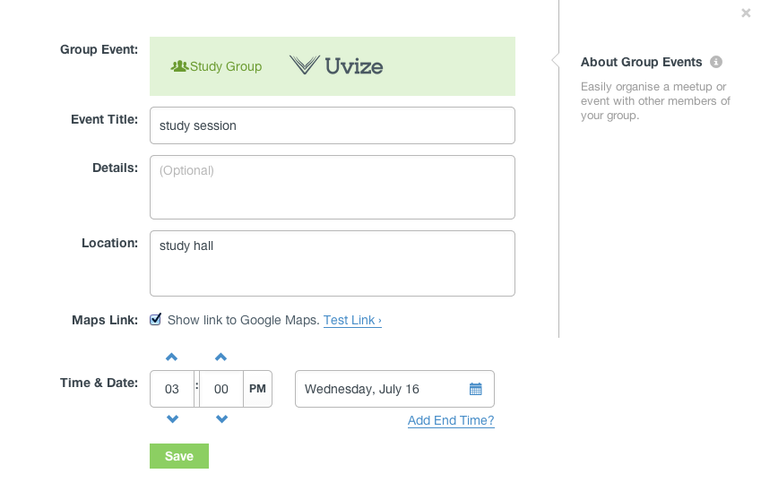
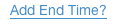
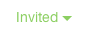
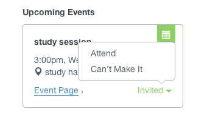
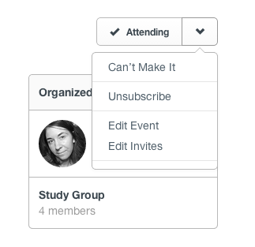

## Events

* [Creating an event](#creating-event)
* [Finding events](#finding-events)
* [Viewing an event](#viewing-event)
* [Managing an event](#managing-event)
* [Flagging an event](flags.html#flagging-event)

Events allow the members of groups to plan places and times to meet in person. Group administrators can create events for anything. Maybe it's a study session for a study group, or a casual social gathering for Army veterans on campus, or a planning meeting for the carpool schedule. All you need is a place and a time!

[back to top](#top)

***

### Creating an event

Events are created from a group's page by an administrator of that group.

From a group's page, click the

link in the sidebar to bring up the event creation form:

You must enter a title, location, and start time. After you enter a location, you can click

to make sure your location works with Google maps. If your event has an end time, click

 to set it.

When you're satisfied with your settings, click

to invite group members to the event:

All group members will be invited by default. Click

to remove all invitations, and

to add them back again. When you're happy with your list of invitations, click

to send them.

[back to guide](community-guide.html) | [back to top](#top)

***

### Finding events

You can find all the upcoming events for a group at the top of the group's page:

If you were invited to an event, you can quickly RSVP by clicking

and choosing an option from the pop-up:

[back to guide](community-guide.html) | [back to top](#top)

***

### Viewing an event

Click

to view an event's page:

Click

if you plan to attend the event, or use the dropdown if you can't make it:

If the event organizer has enabled it, click

to get a map to the event location. Click

to add the event to your calendar.
Click "show all" under the members of the group.  
Click

or

to bring up the event attendance interface:

[back to guide](community-guide.html) | [back to top](#top)

***

### Managing an event

The organizer of an event can change its settings and its invites. From the page for an event you organized, open the dropdown:

Click "Edit Event" to bring up the event's settings:

See the guide for [creating an event](#creating-event) for more information on changing event settings.

Click "Edit Invites" to invite or uninvite group members:

See the guide for [creating an event](#creating-event) for more information on event invitations.

[back to guide](community-guide.html) | [back to top](#top)
