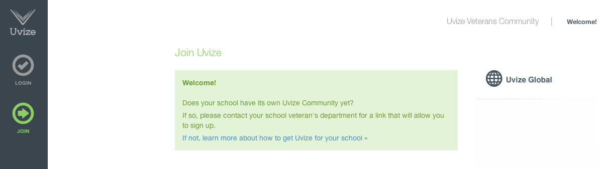
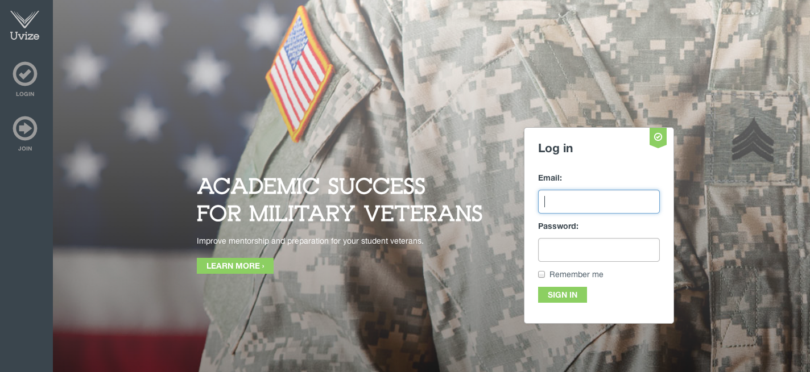
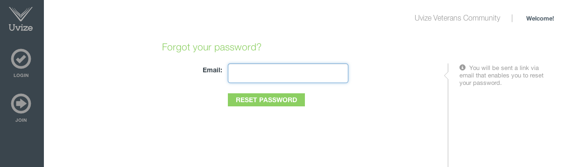
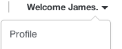
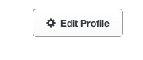
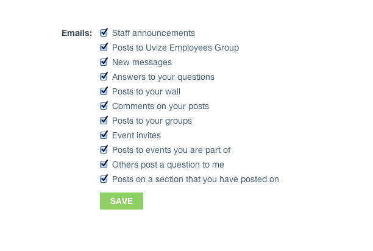
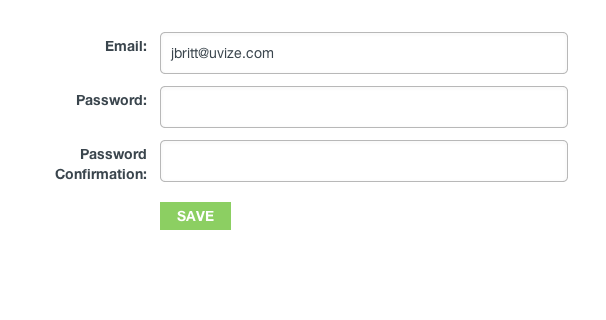
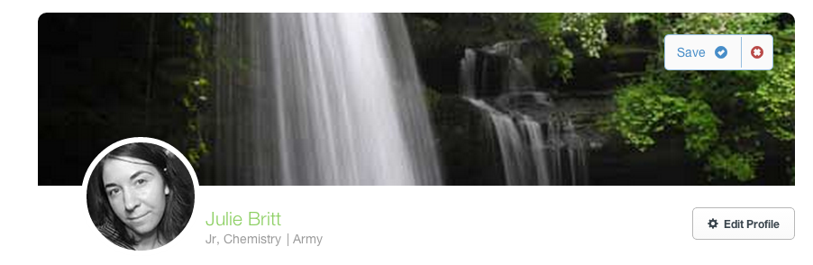
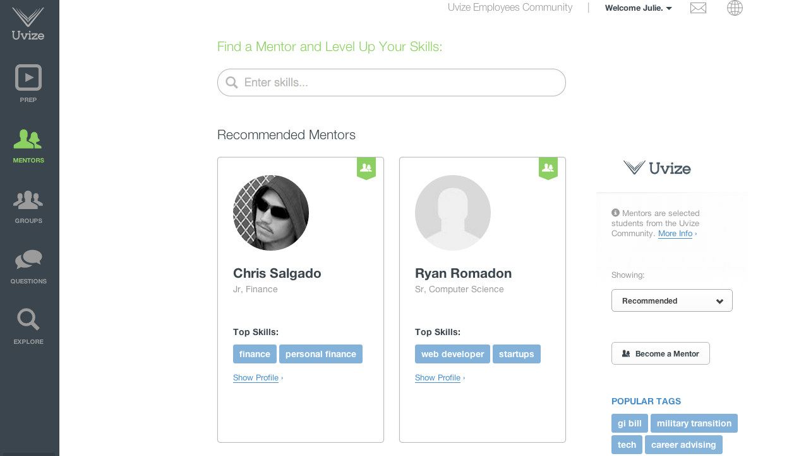

# <a name="top"></top>Frequently Asked Questions

* [My Account](#account)
* [Mentors](#mentors)
* [Groups](#groups)
* [Questions](#Questions)
* [Mobile (iOS and Android)](#mobile)

***

## My Account

* [Creating an account](#create-account)
* [Logging in](#logging-in)
* [Staying logged in](#remember-me)
* [Resetting your password](#reset-password)
* [Editing your profile](#edit-profile)
* [Uploading a profile image](#profile-image)
* [Uploading a cover image](#cover-image)
* [Editing your email preferences](#email-preferences)

[back to top](#top)

***

### Creating an account

You can create an account at [https://www.uvize.com/users/sign_up](https://www.uvize.com/users/sign_up).

Uvize is currently only allowing students to register from schools with a valid activation code.

If your school has a valid activation code, the registration page will look like this:

If you would like to learn how to get Uvize for your school, [click here](http://getuvize.com/).

[back to My Account](#account) | [back to top](#top)

***

### Logging in

You can log in at [Uvize.com](https://www.uvize.com/).

Or at [Uvize.com/users/sign_in](https://www.uvize.com/users/sign_in).

[back to My Account](#account) | [back to top](#top)

***

### Staying logged in

On [Uvize.com](https://www.uvize.com/), you can click the "remember me" checkbox to stay logged into Uvize. This will allow you to close the browser and stay logged in when you reopen the browser to another session.

[back to My Account](#account) | [back to top](#top)

***

### Resetting your password

You can reset your password at the following link: [reset password link](https://www.uvize.com/users/password/new).

After submitting your email address, click the "CHANGE PASSWORD" link within the "Reset password instructions" email.

If you did not submit the password reset request, you can ignore this email and your password will remain unchanged.

[back to My Account](#account) | [back to top](#top)

***

### Editing your profile

At any time, you can edit your profile by clicking your name > profile

Then click the 'edit profile' on your profile page.

From here, you can change your personal details, information, mentor details, email settings, and account settings.

#### Personal Details

Here you can change your profile picture, input your first and last name, and write a bio.

Your bio should be used information about yourself that you'd like to share with others. Your bio is searchable by others, so remember that it'll help others to find you.

See [Uploading a profile image](#profile-image) to learn more about profile images.

#### Information

This is where you can change your major, your year, or your branch of service.

Majors are searchable, so be sure to include yours so other students can see what you're studying.

At this time, your year can be Freshman, Sophomore, Junior, Senior, or Grad Student.

Of course, as a vet-founded company, we love all our military brethren, so be sure to input your branch of service as well if you have served.

#### Mentor Details

On the mentor details tab, you can choose whether or not you want to make yourself available as a mentor.

See [Becoming a mentor](#become-mentor) to learn more about mentorship.

#### Email Settings

Here you can edit your email settings.

See [email preferences](#email-preferences) to learn more about email settings.

#### Account Settings

On the account settings tab, you can choose to hire your profile from global users, change your email address, and change your password.

[back to My Account](#account) | [back to top](#top)

***

### Uploading a profile image

First, go to your profile by clicking your name > profile

Then click the 'edit profile' on your profile page.

From here, click "choose file" which will allow you to select a file from your computer/mobile device to upload as your profile picture.

Finally, click "save". Depending on the size of your file and Internet connection speed, it may take a few seconds to upload your image.

We currently have a 4MB limit for profile image upload sizes.

[back to My Account](#account) | [back to top](#top)

***

### Uploading a cover image

First, go to your profile by clicking your name > profile

From your profile page, hover over the area above your profile image and click "Choose a cover image" on the right-hand side.

This will allow you to select a file from your computer/mobile device to upload as your cover picture.

Finally click "save". Depending on the size of your file and Internet connection speed, it may take a few seconds to upload your image.

We currently have a 4MB limit for cover image upload sizes.

[back to My Account](#account) | [back to top](#top)

***

### Editing your email preferences

At any time, you can edit your profile by clicking your name > profile

Then click the 'edit profile' on your profile page.

Next, click the 'email settings' tab.

There are currently five settings for email notifications which you can enable or disable.

* When someone sends a message.
* When someone posts an answer to a question I posted.
* When someone posts on my wall.
* When someone posts on the wall of a group I am in.
* When someone comments on one of my posts.

You can also unsubscribe from emails via the 'email settings' link within an email

From here, you'll see the same five settings for your account which you can enable or disable.

[back to My Account](#account) | [back to top](#top)

***

## Mentors

* [Becoming a mentor](#become-mentor)
* [Searching mentors](#searching-mentors)
* [Bookmarking mentors](#bookmarking-mentors)
* [Engaging with a mentor](#engaging-mentors)

Mentorship is what makes a Uvize community work. Becoming a mentor is easy! Offering to answer questions within Uvize, and helping other students is how we'll all succeed.

[back to top](#top)

***

### Becoming a mentor

At any time, you can edit your profile by clicking your name > profile

Then click the 'edit profile' on your profile page.

On the mentor details tab, you can choose whether or not you want to make yourself available as a mentor.

If you do, then you can choose to offer your availability globally or just at your school.

You can also input a mentor byline. This is searchable and will help students find you, so be sure to write about how you're willing to help.

Finally, you can input expertise tags. These tags help students find you as well.

[back to Mentors](#mentors) | [back to top](#top)

***

### Searching mentors

From the [mentors page](https://www.uvize.com/community/mentors), you can search mentors.

Just input different search criteria and we'll search mentors by tags, mentor bylines, bio, and major.

[back to Mentors](#mentors) | [back to top](#top)

***

### Bookmarking mentors

Bookmarking a mentor allows you to 'save' a mentor that has been helpful to you or that you'd like to keep in contact with.

From a mentor's profile page, just click "Save to 'My Mentors'"

Now that mentor will show up on the mentors page.

[back to Mentors](#mentors) | [back to top](#top)

***

### Engaging with a mentor

Mentorship is fundamental in the success of students. When engaging with a mentor, always be respectful of the mentor's time. Mentors volunteer themselves to help others out of their own time. Do not be rude or harass a mentor. If a mentor is unable to help you, then politely thank them for their time and reach out to another mentor who may be able to help you.

[back to Mentors](#mentors) | [back to top](#top)

***

## Groups

* Creating a group
* Editing a group
* Tagging a group

[back to top](#top)

***

## Questions

* Creating a question
* Editing a question
* Tagging a question

[back to top](#top)
