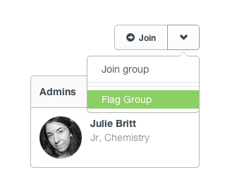

## Flags

* [Adding a Flag](flags.html#flags)
* [Flagging a Group](flags.html#flagging-group)
* [Flagging a User](flags.html#flagging-user)
* [Flagging an Event](flags.html#flagging-event)

[back to top](#top)

***

### Adding a Flag

You can flag any comment, question or answer as inappropriate by simply hovering above and clicking the down arrow, then selecting 'Flag'.

A confirmation window will appear and ask if you would like to mark as inappropriate.

The comment will then be sent to a moderator for review.  If it is found to be inappropriate, it will be removed. 

[back to guide](community-guide.html) | [back to top](#top)

***

Additionally you can flag Groups, Users or Events as inappropriate.  

### Flagging a Group
From the Group page, click the down arrow next to the Join button and select the 'Flag Group' option.  

***

### Flagging a User
From the User page, click the down arrow next to the Message button and select the 'Flag User' option.  

***

### Flagging an Event
From the Event page, click the down arrow next to the Attend button and select the 'Flag Event' option.  

[back to guide](community-guide.html) | [back to top](#top)

***
