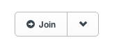
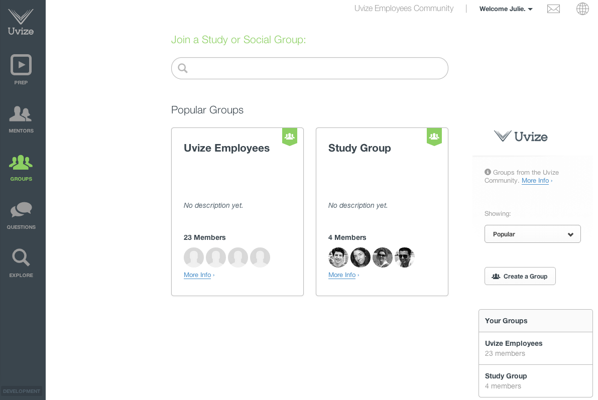

## Groups

* [Creating a group](#creating-group)
* [Administering a group](#admin-group)
* [Group privacy](#group-privacy)
* [Joining a group](#joining-group)
* [Leaving a group](#leaving-group)
* [Searching groups](#searching-groups)
* [Flagging a group](flags.html#flagging-group)

Groups are a place to where students, mentors, and staff can meet and discuss common interests. Groups are commonly used for things such as common backgrounds (Army, MOS, etc), study groups (Bio 101 study group), majors (Mechanical Engineering majors), interests (Anime, TV shows), and more (Carpooling, etc).

[back to top](#top)

***

### Creating a group

Creating a group is easy. From the [groups page](https://www.uvize.com/groups), click the "Create a Group" button.

From here, you must supply a group name. Optionally, you can add a description and tags for the group. The description and tags help others find your group when searching for groups.

Finally, you must choose the privacy level of your group. See [Group Privacy](#group-privacy) to learn more about privacy.

[back to guide](community-guide.html) | [back to top](#top)

***

### Administering a group

As a group administrator, you can edit your group settings at any time.

From the group's page, click the "Edit Group" button:

Once clicked, the group settings form used to create the group, is now editable.  

From here, you can view members, admins, pending requests, blocked, and add classmates.

On the members/admins tabs, you can see current members or admins and you have the ability to remove them, add them as an admin, or block them. To remove as a member, just uncheck them. To add them as an admin or block them, hover over their profile, then click options, and the corresponding checkbox.

For closed groups, when a user requests to join, they will show up on the pending requests tab.

For users that have been blocked, they will show up on the blocked tab.

Finally, the add classmates tab will show all of your school classmates, where you can add others to your group.

[back to guide](community-guide.html) | [back to top](#top)

***

### Group Privacy

There are two levels of privacy for groups within Uvize: Open or Closed.

* Open - The group message board and members are public, and anyone from your school can join the group.
* Closed - The group message board and members can only be seen by members. The group will still show up in search and new members can request an invite to join the group.

When you're on a closed group that you're not a member of, you can request to join by clicking the "request to join" button.

Additionally, groups from your school are _never_ viewable by a user at another school.

[back to guide](community-guide.html) | [back to top](#top)

***

### Joining a group

You can join an open group at any time. Simply click the "Join" button on the group's page or the 'Join up Now' link.

When you're on a closed group that you're not a member of, you can request to join by clicking the "request to join" button.

[back to guide](community-guide.html) | [back to top](#top)

***

### Leaving a group

When you leave a group, you have the ability to not allow others to add you back to the group. This prevents others from continually adding you to a group over and over again.

If you're an admin for a group and you leave, you'll be warned if you're the last admin and that you should make someone else an admin before you leave, otherwise anyway can claim the admin position.

[back to guide](community-guide.html) | [back to top](#top)

***

### Searching groups

From the [groups page](https://www.uvize.com/groups), you can search groups.

Just input different search criteria and we'll search groups by group name, tags, and description.

[back to guide](community-guide.html) | [back to top](#top)
