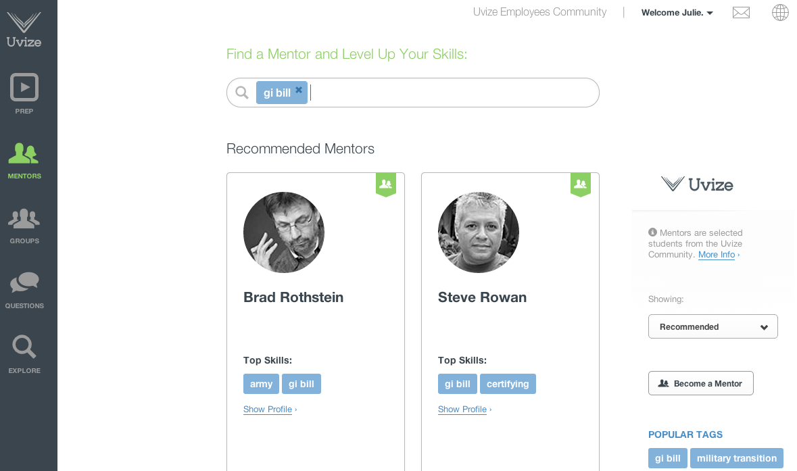
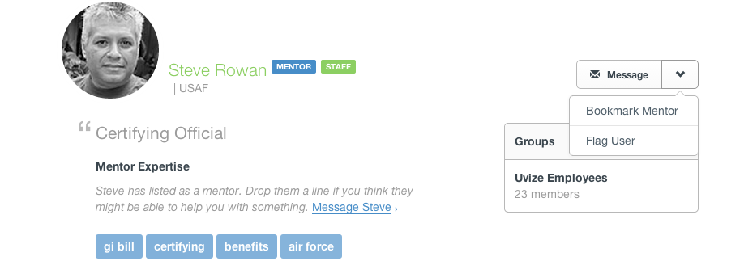

## Mentors

* [Becoming a mentor](#become-mentor)
* [Searching mentors](#searching-mentors)
* [Bookmarking mentors](#bookmarking-mentors)
* [Engaging with a mentor](#engaging-mentors)

Mentorship is what makes a Uvize community work. Becoming a mentor is easy! Offering to answer questions within Uvize, and helping other students is how we'll all succeed.

[back to top](#top)

***

### Becoming a mentor

At any time, you can edit your profile by clicking your name > profile

Then click the 'edit profile' on your profile page.

On the mentor details tab, you can choose whether or not you want to make yourself available as a mentor.

If you do, then you can choose to offer your availability globally or just at your school.

You can also input a mentor byline. This is searchable and will help students find you, so be sure to write about how you're willing to help.

Finally, you can input expertise tags. These tags help students find you as well.

[back to guide](community-guide.html) | [back to top](#top)

***

### Searching mentors

From the [mentors page](https://www.uvize.com/mentors), you can search mentors.

Just input different search criteria and we'll search mentors by tags, mentor bylines, bio, and major.

[back to guide](community-guide.html) | [back to top](#top)

***

### Bookmarking mentors

Bookmarking a mentor allows you to 'save' a mentor that has been helpful to you or that you'd like to keep in contact with.

From a mentor's profile page, click the arrow to the right of the message block, and select "Bookmark Mentor" from the dropdown menu.

Now the mentor will show up on the mentors page under "Your Mentors".

[back to guide](community-guide.html) | [back to top](#top)

***

### Engaging with a mentor

Mentorship is fundamental in the success of students. When engaging with a mentor, always be respectful of the mentor's time. Mentors volunteer themselves to help others out of their own time. Do not be rude or harass a mentor. If a mentor is unable to help you, then politely thank them for their time and reach out to another mentor who may be able to help you.

[back to guide](community-guide.html) | [back to top](#top)
