# Mobile Guide

We currently do not have a downloadable mobile app for Uvize. However, we have an incredibly mobile friendly site with easy-to-use instructions on setting up your device to act as though it is a mobile app.

* [iOS](#iOS)
* [Android](#android)

***

## iOS

* [Setting up Uvize as a mobile app](#setup-iOS)

[back to top](#top)

***

### Setting up Uvize as a mobile app

1. Go to [https://www.uvize.com](https://www.uvize.com):

  <a href="gfx/uvize-iOS-1.png">
    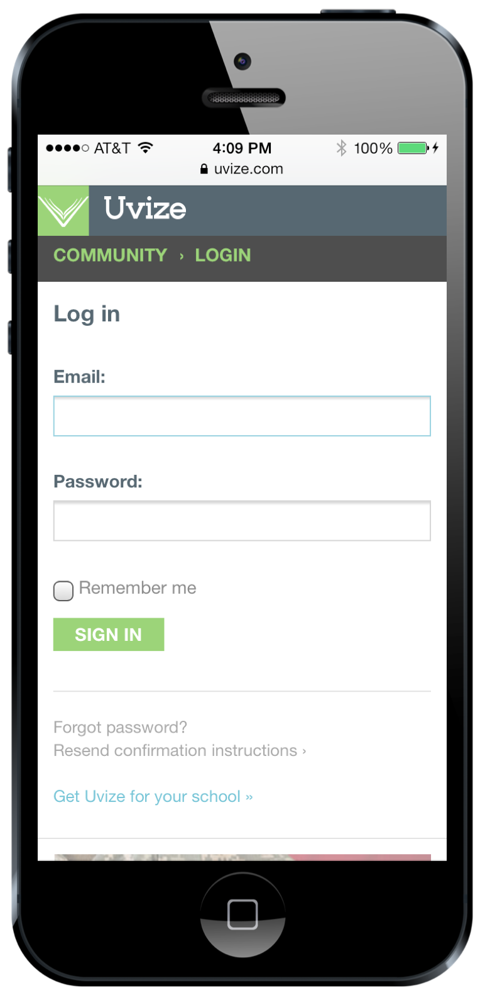
  </a>

2. Click the options button:

  <a href="gfx/uvize-iOS-2.png">
    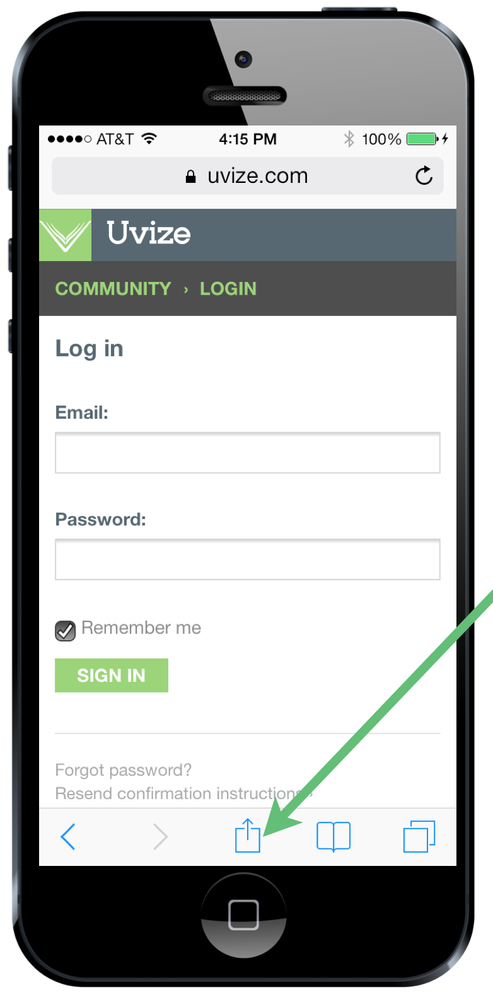
  </a>

3. Click "add to home screen":

  <a href="gfx/uvize-iOS-3.png">
    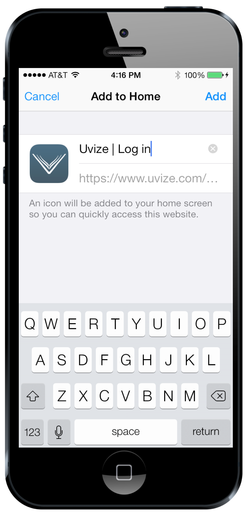
  </a>

4. Click "Add" and you are done:

  

5. The icon now shows on your home screen. Remember to click "remember me" for quicker access:

  <a href="gfx/uvize-iOS-5.png">
    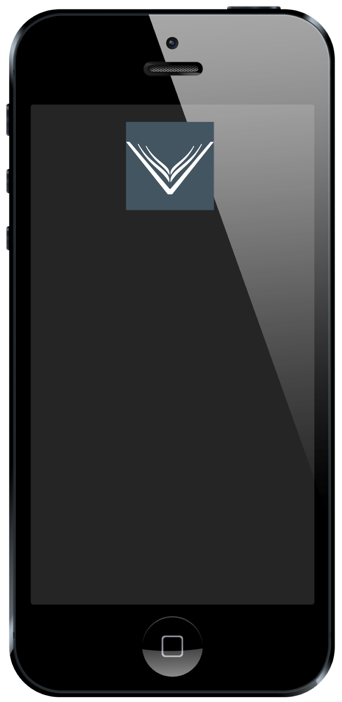
  </a>

[back to iOS](#iOS) | [back to top](#top)

***

## Android

* [Setting up Uvize as a mobile app](#setup-android)

[back to top](#top)

***

### Setting up Uvize as a mobile app

1. Go to [https://www.uvize.com](https://www.uvize.com) in Chrome and click the options button:

  <a href="gfx/uvize-android-1.png">
    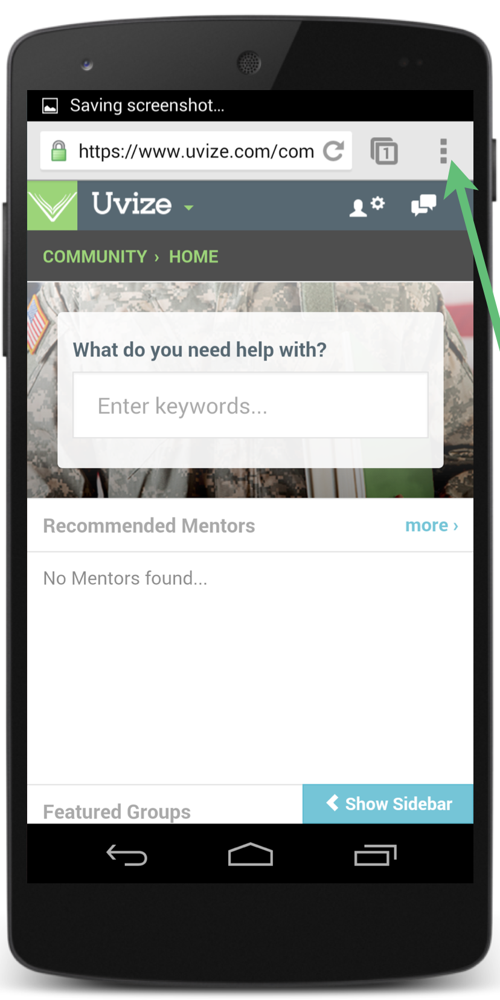
  </a>

2. Click the Bookmark Star:

  <a href="gfx/uvize-android-2.png">
    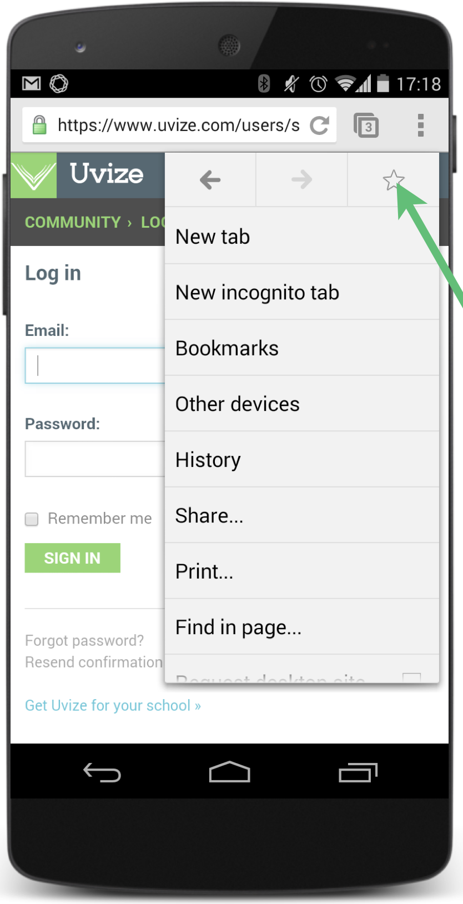
  </a>

3. Click Save:

  <a href="gfx/uvize-android-3.png">
    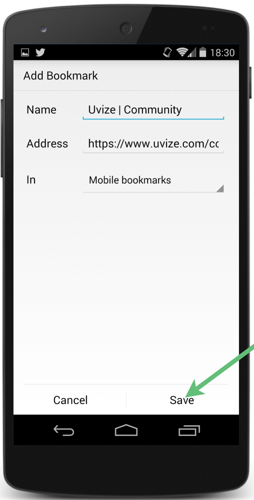
  </a>

4. Click options:

  <a href="gfx/uvize-android-4.png">
    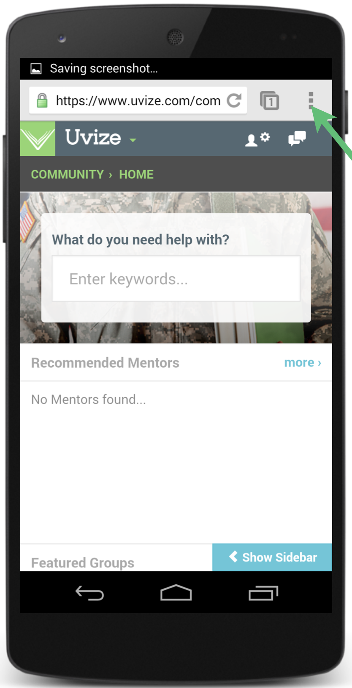
  </a>

5. Click bookmarks:

  <a href="gfx/uvize-android-5.png">
    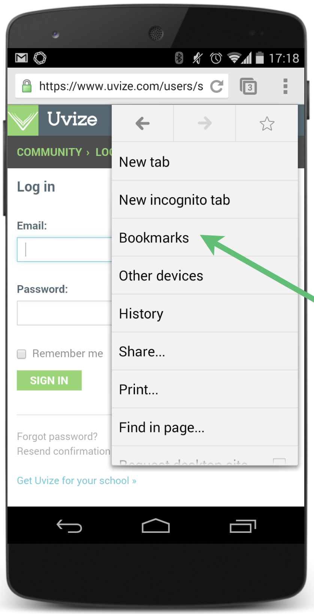
  </a>

6. Press and hold bookmark:

  <a href="gfx/uvize-android-6.png">
    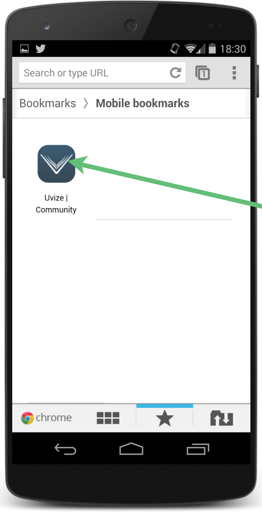
  </a>

7. Click Add to Home Screen:

  <a href="gfx/uvize-android-7.png">
    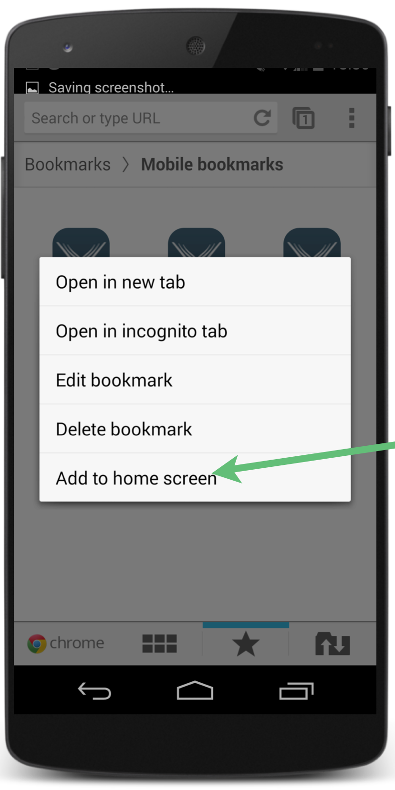
  </a>

8. The icon now shows on your home screen. Remember to click "remember me" for quicker access:

  <a href="gfx/uvize-android-8.png">
    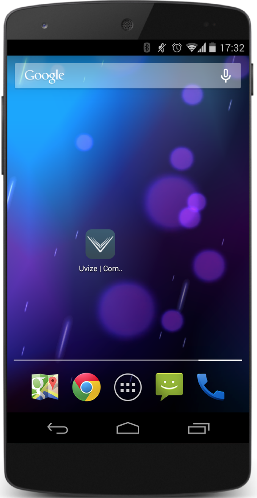
  </a>

[back to Android](#android) | [back to top](#top)
