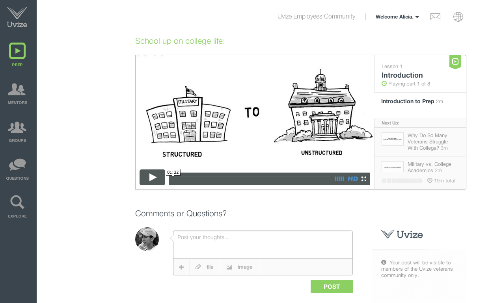
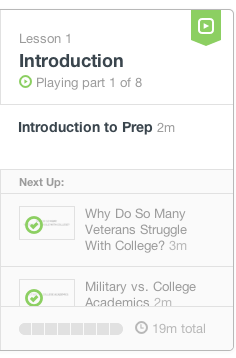
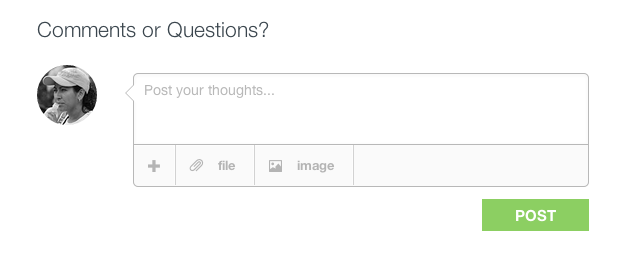

## Prep

* [Prep Videos](prep.html#prep)

***

### Playing videos

From the [prep page](https://www.uvize.com/prep), a video control box will be displayed at the top of the page. 

From this box you can control which video is currently playing and as well as all the standard video controls.  
On the right of the box is a list of the prep videos.  

***

There is also a spot to post your comments and/or questions.  

[back to guide](community-guide.html) | [back to top](#top)
***
