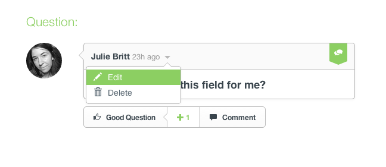
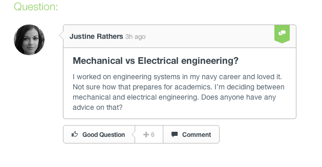
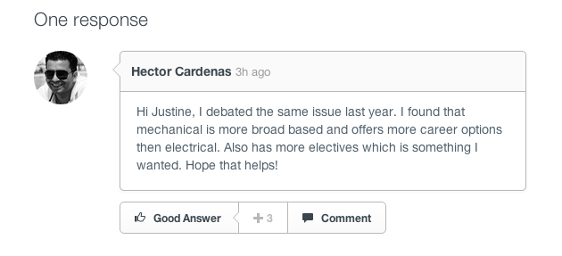
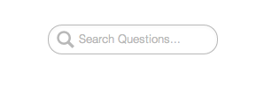
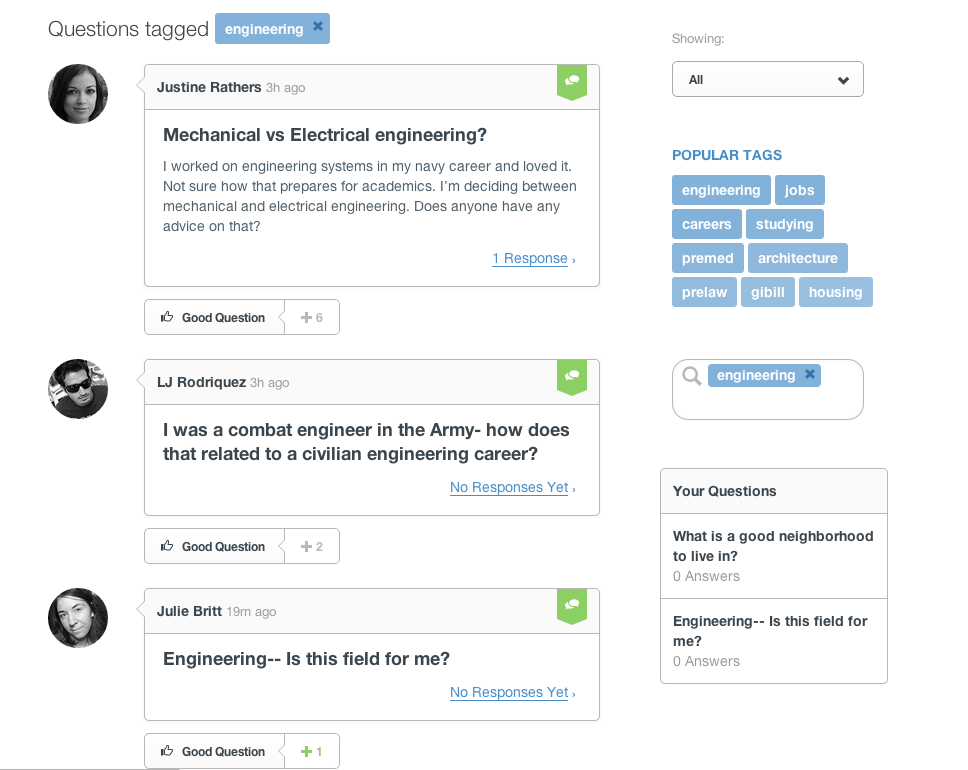

## Questions

* [Asking a question](#asking-question)
* [Editing a question](#editing-question)
* [Deleting a question](#deleting-question)
* [Upvoting](#voting)
* [Searching questions](#searching-questions)
* [Answering a question](#answering-question)
* [Flagging a question](flags.html#flags)

[back to top](#top)

***

### Asking a question

From the [questions page](https://www.uvize.com/questions), a question form will be displayed at the top of the page.

From here, you must supply a question. Optionally, you can add a larger description of your question.  The list of recommended questions changes as you type to help you find what you are looking for.  
Next, click the "Ask" button and keywords and tags can be added to help focus your question to those who are searching for similar questions.  

Once the "Post" button is clicked, up to three mentors with the same tags as your question in their profile will be notified of your question.  

[back to guide](community-guide.html) | [back to top](#top)

***

### Editing a question

If you asked a question, you can edit it to further refine details or updates about the question.

From the question's page, hover over your question and click the down arrow and select "Edit" from the dropdown menu.

[back to guide](community-guide.html) | [back to top](#top)

***

### Deleting a question

If you asked a question, you can delete it if you want to remove it.

WARNING: if you remove a question, it will no longer be searchable. If others' have answered your question, you should leave it up so that others can benefit from finding your question and answers if they have the same question.

From the question's page, hover over your question and click the down arrow and select "Delete" from the dropdown menu.

This will bring up a confirmation before deletion. Click "Delete" if you'd like to delete the question.

[back to guide](community-guide.html) | [back to top](#top)

***

### Upvoting

Voting helps the most useful content, whether it's a question or an answer, be found easier by other users.

From the [questions page](https://www.uvize.com/questions), you can upvote questions to help bring the best answers to the top of the search.  Just click the "Good Question" button below each question.

From a question's page, you can upvote the question or answer as well. Just click the "Good Question" or "Good Answer" button below each question or answer. 

[back to guide](community-guide.html) | [back to top](#top)

***

### Searching questions

From the [questions page](https://www.uvize.com/questions), you can search questions by using the search bar on the lower right portion of the screen just below the popular tags.  

Just input different search criteria and we'll search questions by group name, tags, and description.

You can further sort the questions by new questions.

[back to guide](community-guide.html) | [back to top](#top)

***

### Answering a question

From a question's page, you can answer it by filling out the form below the question.

Answering questions is how we, as a community, can give back to one another.

[back to guide](community-guide.html) | [back to top](#top)
