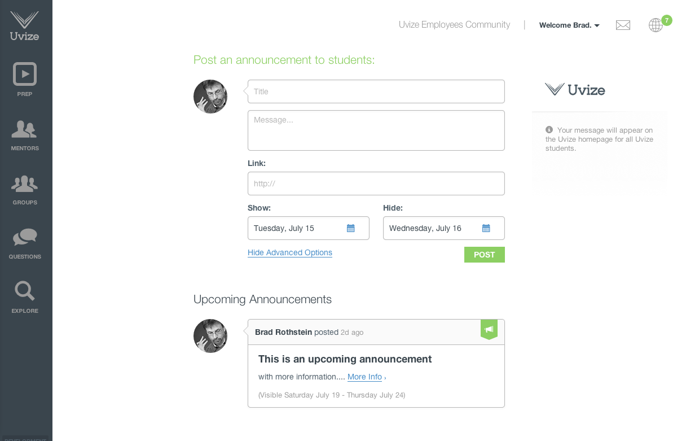
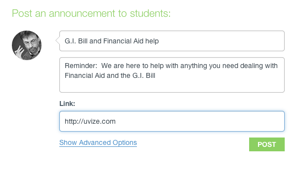
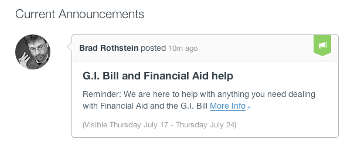
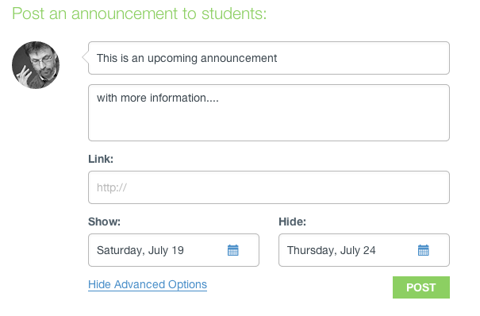
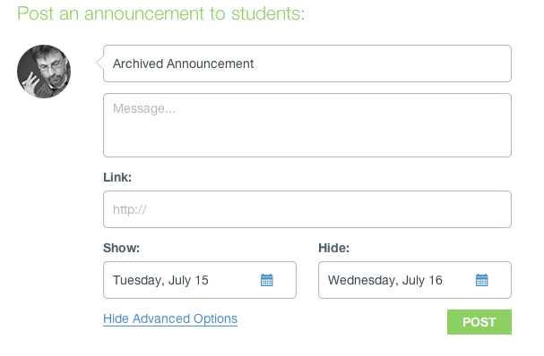
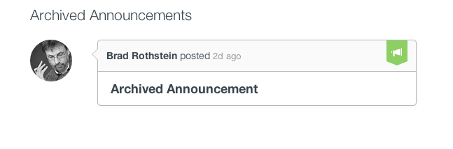

# Staff Guide

* [Announcements](#announcements)

***

## Announcements

You can manage announcements at any time by going to the [Admin Announcement Page](https://www.uvize.com/admin/announcements):

Non-staff users will not have access to this page.

* [Creating Announcements](#creating-announcements)
* [Editing Announcements](#editing-announcements)
* [Archiving Announcements](#archiving-announcements)
* [Deleting Announcements](#deleting-announcements)

[back to top](#top)

***

### Creating Announcements

Creating an announcement is simple. You can create announcements that go live to all students immediately, or for upcoming announcements, or for archived announcements. Once live, students who are subscribed to receive announcement emails will receive an email and all other users will receive a notification as well.

1. Go to the [Admin Announcement Page](https://www.uvize.com/admin/announcements):

  

2. Fill out the form. Any link you provide will be included in the 'more info' link (see #4 below).

  

3. If you want to change the show and hide dates for the announcement, click the  link.

  

4. Click the Post button and the announcement will be live:

  

If you change the show date to be after today, then the announcement will not be sent out until that date and will show up under Upcoming:

  

  

If you change the hide date to be before today, then the announcement will automatically be Archived:

  

  

[back to Announcements](#announcements) | [back to top](#top)

***

### Editing Announcements

You can easily edit any announcements that you make.

1. Go to the [Admin Announcement Page](https://www.uvize.com/admin/announcements):

  

2. Hover over the appropriate announcement and click the down arrow then select the 'edit' link:

  

  

3. As with creating, fill out the form as you wish. Remember, if you change the show or hide date, it will move the announcement to the appropriate list: current, upcoming, or archived.

[back to Announcements](#announcements) | [back to top](#top)

***

### Archiving Announcements

You can quickly archive an announcement if you no longer want it to be shown to students. Archiving an announcement is the same thing as editing an announcement so that the hide date is right this minute.

1. Go to the [Admin Announcement Page](https://www.uvize.com/admin/announcements):

  

2. Hover over the appropriate announcement and click the down arrow and select the 'archive' link:

  

That's it! The announcement is now archived.

[back to Announcements](#announcements) | [back to top](#top)

***

### Deleting Announcements

Deleting announcements is a permanent action and will immediately remove the announcement for all users. There is no warning on deletion, so be careful!

1. Go to the [Admin Announcement Page](https://www.uvize.com/admin/announcements):

  

2. Hover over the appropriate announcement and click the down arrow and select the 'delete' link and the announcement will immediately be deleted:

  

Removing an announcement will not prevent previously sent emails which went out with the announcement from being viewed, but it will delete the corresponding notifications.

[back to Announcements](#announcements) | [back to top](#top)

***
